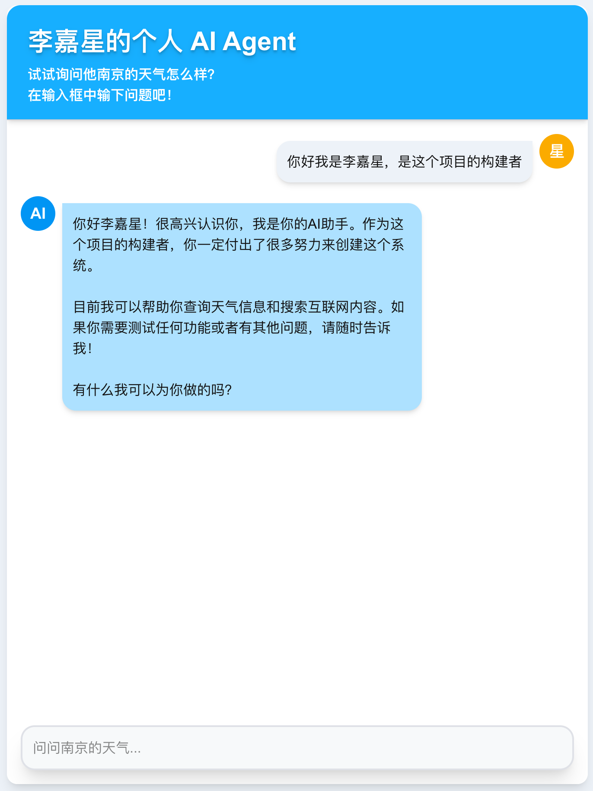

# 李嘉星的个人 AI Agent

一个基于 Next.js（App Router）+ Vercel AI SDK 的个人 AI Agent Demo：支持自然语言对话，并在需要时自动调用预置技能（天气查询 / 联网搜索）来增强回答。



## 功能简介
- 对话：流式输出（SSE），前端使用 `@ai-sdk/react` 的 `useChat()`
- 模型：DeepSeek（通过 OpenAI-compatible 接口接入）
- Tools/Skills：
  - `getWeather`：天气查询（目前为模拟数据，可替换真实天气 API）
  - `webSearch`：联网搜索（基于 Tavily，返回精简摘要与链接）

## 技术栈
- 前端：Next.js + React + TailwindCSS
- 对话能力：Vercel AI SDK（`ai`、`@ai-sdk/react`）
- 大模型：DeepSeek（OpenAI-compatible）
- 联网搜索：Tavily

## 环境准备
- Node.js（建议 18+）
- 包管理器：`npm` / `pnpm` / `yarn` 均可（下方以 `npm` 示例）

## 快速开始（安装与启动）
1) 安装依赖
```bash
npm install
```

2) 配置环境变量

在项目根目录创建 `.env.local`：
```bash
# DeepSeek API Key（必填）
DEEPSEEK_API_KEY=your_deepseek_api_key

# Tavily API Key（可选：不填则“联网搜索”不可用/会报错）
TAVILY_API_KEY=your_tavily_api_key
```

3) 启动开发环境
```bash
npm run dev
```

打开：http://localhost:3000

4) 生产构建与启动
```bash
npm run build
npm run start
```

## 已内置 Skills（Tools）
后端在 [app/api/chat/route.ts](app/api/chat/route.ts) 中注册工具（`tools`），模型会在需要时自动选择调用。

### 1) `getWeather`（天气查询）
- 代码位置：[lib/skills/weather.ts](lib/skills/weather.ts)
- 入参：`{ city: string }`
- 说明：当前为“模拟数据”（随机温度 + 固定“晴朗”）。你可以在该文件内替换为真实天气 API（如高德/和风等）。
- 返回示例：
```json
{
	"location": "南京",
	"temperature": 22,
	"unit": "摄氏度",
	"condition": "晴朗"
}
```

### 2) `webSearch`（联网搜索 / Tavily）
- 代码位置：[lib/skills/search.ts](lib/skills/search.ts)
- 入参：`{ query: string }`
- 依赖：需要配置 `TAVILY_API_KEY`
- 返回：最多 5 条结果，每条包含 `title` / `url` / `content`

## API 调用示例
该项目的对话接口为：`POST /api/chat`

用 `curl` 快速测试：
```bash
curl -sS -X POST http://localhost:3000/api/chat \
	-H 'content-type: application/json' \
	--data '{"messages":[{"id":"1","role":"user","parts":[{"type":"text","text":"南京天气"}]}]}'
```

## 如何新增一个 Skill
1) 在 [lib/skills](lib/skills) 下新增一个 `xxx.ts`，用 `tool(...)` 定义输入 schema 与 `execute`。
2) 在 [lib/skills/index.ts](lib/skills/index.ts) 导出它。
3) 在 [app/api/chat/route.ts](app/api/chat/route.ts) 的 `tools` 对象里注册（例如新增 `myTool: myToolImpl`）。

（可选）如果你想在 UI 中显示更友好的技能名称，可以在 [app/page.tsx](app/page.tsx) 里对 `toolName` 做映射展示。
